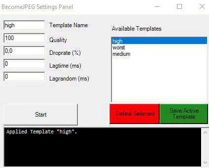
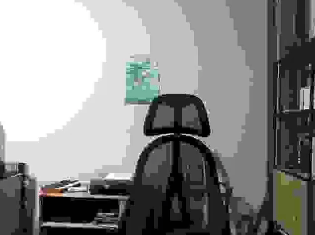

# BecomeJPEG
A tiny project powered by EgmuCV (the .NET OpenCV wrapper) to capture a webcam video stream, and JPEG compress and preview it in real time.

### Features

Upon startup, you will be presented with the Settings Panel. This is a small comprehensive window to configure the settings of the application even before it first activates your webcam.

Here's a gif showing that changing templates has become much easier as opposed to how it was in the console (no more typing, just double click one!).

As before, saving a template with the active settings will override old templates of the same name.

The GUI also features a small black textbox for logging. The same messages will also be saved in a log.txt next to the application (similarly to the templates.txt).

#### Scuff me up (Settings and what they do)

- Quality: how much of the original images original quality is preserved. 0 is maximum JPEG.
- Droprate: the chance of every frame to simply be skipped
- Lagtime: the time in milliseconds of how long to stop accepting new frames
- Lagrandom: an additive random value of milliseconds from 0 to the number you put in to add to the lag
- Repeat Chance: the random chance every frame (except for when its on cooldown) to initiate a repeat 
  of the frames stored in the buffer.
- Buffer Size: how many frames to store for the repeat effect. 
  it is recommended to keep this pretty low (depends on your framerate, but 12 is pretty good by default)
  :warning: updating this setting while the webcam window is open will not have an effect :warning:
- Repeat Cooldown: how many milliseconds to wait before a repeat can be triggered again.
- Repeat Chain: how many times a repeat can be triggered before the cooldown is initiated. 
  :warning: ALWAYS keep this at 1 or higher. :warning:

- Additionally features a drop down selection for which webcame source you would like to use. This should pick up every standard webcam and OBS's virtual cam.

### Examples 

Here's a view of the default supplied "worst" quality template. Input is given by "Creative Live! Cam Sync 1080p V2":

### Notes

Depending on your CPU and the target resolution, it will demand a lot. So keeping the capture resolution low is recommended (configuration of this is a planned feature ATM).

The Settings Panel is made with basic WinForms, just because i don't really plan on making it super fancy, it should just get things done for now. It can be improved later if need be.